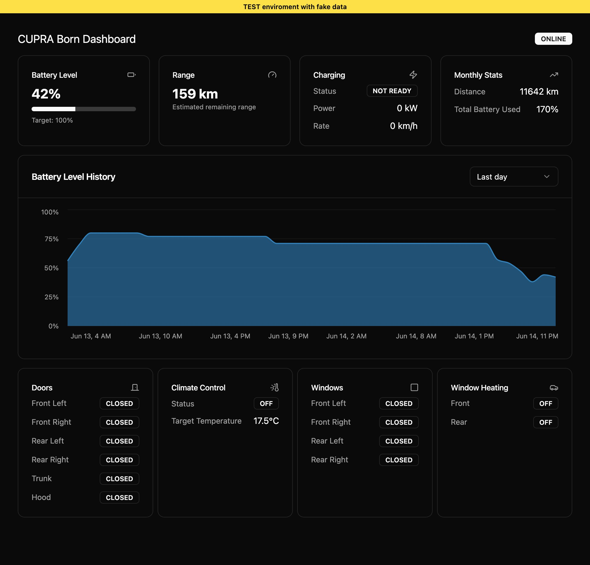

# Cuborn - A Cupra App Dashboard Replacement

The car app from the manufacturer of my EV was frequently taking more than 10 seconds to load, just to display the current battery percentage, so I decided to build my own version over a weekend.

This PWA consolidates all available information from the WeConnect API into a single dashboard. The main goal was to create a fast-loading app with all the information I care about regarding my Cupra Born.

A preview environment with fake data can be viewed at [cuborn-test.florentcollinpro.workers.dev](https://cuborn-test.florentcollinpro.workers.dev/).

This repository contains the Hono API running on Cloudflare Workers, D1 and Durable Objects, as well as the frontend built with React.

> \[!note]
> I built this app solely for my personal use, so it's not ready for deployment by others. If you're interested in deploying the solution, please reach out, and we can discuss how best to make it work for you.
> In theory, the app should be compatible with all vehicles that use the WeConnect API, but I have only tested it with the Cupra Born.



### Installation & Deployment

Bun is the package manager used for this project, and Turborepo is used to build respecting dependency order.

```bash
bun install
bunx turbo deploy
```

### Development Environment

Run:

```bash
bun dev
```

### Project Structure

The project structure is as follows:

```bash
packages
├── api # Hono API running in a Cloudflare Worker
├── frontend # React frontend with Tanstack Router
└── weconnect # Cron to retrieve data from the WeConnect API
```

The following files may be useful for exploring the codebase:

- API entry point: [api/src/index.ts](./packages/api/src/index.ts)
- API Router with TRPC: [api/src/routers/app.ts](./packages/api/src/routers/app.ts)
- Vehicle Status service: [api/src/core/services/vehicle-status.service.ts](./packages/api/src/core/services/vehicle-status.service.ts)
- Frontend entry point: [frontend/src/main.tsx](./packages/frontend/src/main.tsx)
- Car Dashboard widget: [frontend/src/components/car-dashboard.tsx](./packages/frontend/src/components/car-dashboard.tsx)
- Weconnect Python cron: [weconnect/cron.py](./packages/weconnect/cron.py)

> \[!note]
> Currently, the Weconnect cron is implemented in Python but will soon be ported to a Cloudflare cron.

### Learnings from This Project

### Other Useful Commands

All useful commands for this project:

```bash
# Build all packages
bunx turbo build
# Type check the entire codebase
bunx turbo tsc
# Format and check the codebase using Biome
bun format && bun check
```
